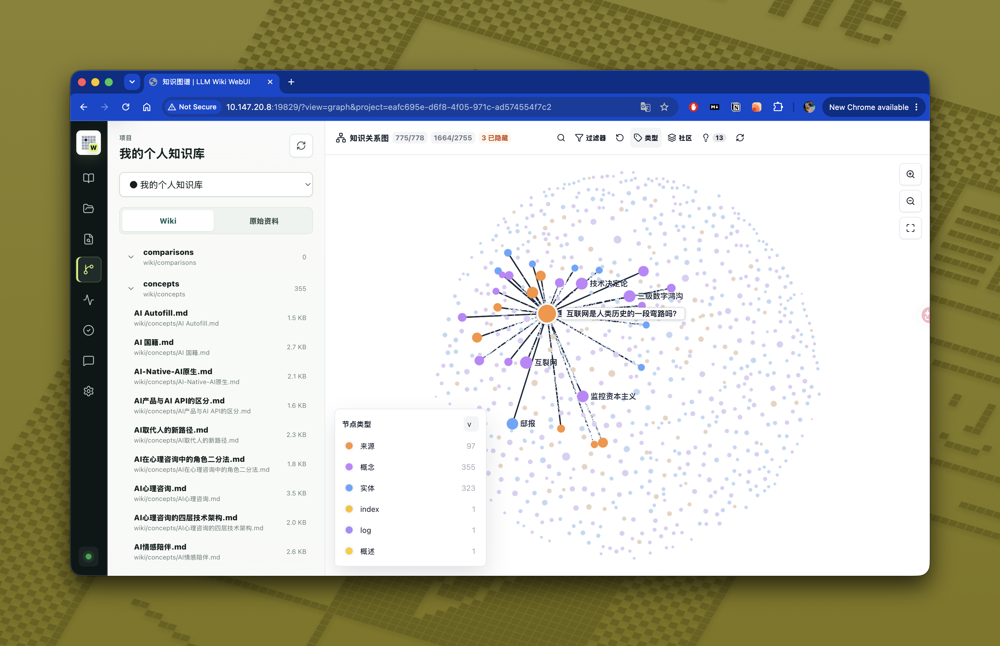

# LLM Wiki WebUI

English | [中文](#中文)

API-only Docker WebUI for the native [nashsu/llm_wiki](https://github.com/nashsu/llm_wiki) desktop app.

LLM Wiki WebUI is a separate, non-invasive companion project. It does not modify or embed the native LLM Wiki runtime. Instead, it serves a browser UI and proxies browser requests to the local LLM Wiki HTTP API.

Its main use case is making your LLM Wiki available across your LAN, and in selected public-network scenarios. Pair it with tools such as ZeroTier or other private networking / tunneling solutions to access your LLM Wiki from any device, anywhere.

## Demo Screenshot



## What It Provides

- Project switching through the native API.
- Wiki and source file trees with read-only content preview.
- Markdown rendering with wiki-style links.
- Search backed by the native LLM Wiki retrieval API.
- Knowledge graph visualization modeled after the original LLM Wiki graph UI.
- Review list, source rescan, API diagnostics, and read-only lint checks.
- Clear disabled states for native-only actions that the HTTP API does not expose yet.

## One-Line Docker Start

Start the native LLM Wiki desktop app first and enable its local HTTP API. The default native API address is:

```text
http://127.0.0.1:19828/api/v1
```

Then run this WebUI with one command:

```bash
docker run -d --name llm-wiki-webui --restart unless-stopped -p 19829:19829 --add-host=host.docker.internal:host-gateway -e WEBUI_ACCESS_TOKEN=change-this-webui-token -e LLM_WIKI_API_BASE_URL=http://host.docker.internal:19828 -e LLM_WIKI_API_TOKEN=your-native-api-token-if-required ghcr.io/pls-1q43/llm-wiki-webui:latest
```

Open:

```text
http://localhost:19829
```

## Pasteable Compose

Save this as `compose.yaml`, change `WEBUI_ACCESS_TOKEN`, adjust `LLM_WIKI_API_TOKEN` only if your native API requires auth, then run `docker compose up -d`.

```yaml
services:
  llm-wiki-webui:
    image: ghcr.io/pls-1q43/llm-wiki-webui:latest
    container_name: llm-wiki-webui
    restart: unless-stopped
    ports:
      # WebUI address on the host.
      - "19829:19829"
    environment:
      # Port used by the WebUI inside the container.
      PORT: "19829"
      # Required. This protects the browser WebUI and proxy when exposed to LAN, ZeroTier, or the internet.
      WEBUI_ACCESS_TOKEN: "change-this-webui-token"
      # Optional. Use "true" only for trusted local development.
      WEBUI_AUTH_DISABLED: "false"
      # Native LLM Wiki API on the host machine.
      LLM_WIKI_API_BASE_URL: "http://host.docker.internal:19828"
      # Optional. Server-side token forwarded only to the native LLM Wiki API.
      LLM_WIKI_API_TOKEN: ""
      # Optional upstream API timeout.
      LLM_WIKI_PROXY_TIMEOUT_MS: "30000"
    extra_hosts:
      # Needed on Linux so containers can reach services running on the host.
      - "host.docker.internal:host-gateway"
```

For local development before a published image is available, this repository also includes a buildable `docker-compose.yml`:

```bash
docker compose up --build
```

Linux support is included through:

```yaml
extra_hosts:
  - "host.docker.internal:host-gateway"
```

## Runtime Configuration

| Variable | Default | Description |
| --- | --- | --- |
| `PORT` | `19829` | WebUI server port. |
| `HOST` | `0.0.0.0` | WebUI bind address. |
| `WEBUI_ACCESS_TOKEN` | unset | Required by default. Protects WebUI pages and `/api/llm-wiki/*`. |
| `WEBUI_AUTH_DISABLED` | `false` | Set to `true` only for trusted local development without WebUI auth. |
| `LLM_WIKI_API_BASE_URL` | `http://host.docker.internal:19828` | Native LLM Wiki API base URL. |
| `LLM_WIKI_API_TOKEN` | unset | Optional bearer token forwarded server-side to the native API; it is never exposed to the browser. |
| `LLM_WIKI_PROXY_TIMEOUT_MS` | `30000` | Proxy timeout for upstream API requests. |

Do not commit local tokens. Use `.env.local` for local development; it is ignored by Git.

## Development

```bash
npm install
npm run dev
```

Production parity:

```bash
npm run build
WEBUI_ACCESS_TOKEN=change-this-webui-token LLM_WIKI_API_BASE_URL=http://127.0.0.1:19828 PORT=19829 npm start
```

Useful scripts:

- `npm run typecheck` checks TypeScript.
- `npm run test` runs unit tests.
- `npm run build` builds the production WebUI.
- `npm start` serves `dist/` and proxies `/api/llm-wiki/*`.

## License And Relationship To LLM Wiki

This project is designed to follow the user experience of [nashsu/llm_wiki](https://github.com/nashsu/llm_wiki) where the public HTTP API allows it. Some UI logic and visual patterns are adapted from the original GPLv3 project with attribution.

Native-only capabilities remain disabled until LLM Wiki exposes matching HTTP endpoints. Examples include project creation, source import/delete, wiki editing, auto-fix, chat, and Deep Research orchestration.

LLM Wiki WebUI follows the upstream project license: GNU General Public License v3.0. See [NOTICE](NOTICE) for attribution and [LICENSE](LICENSE) for licensing.

---

## 中文

[English](#llm-wiki-webui) | 中文

LLM Wiki WebUI 是原生桌面应用 [nashsu/llm_wiki](https://github.com/nashsu/llm_wiki) 的 API-only Docker WebUI。

这是一个独立、非侵入式的伴随项目。它不会修改或嵌入原生 LLM Wiki 运行时，而是提供一个浏览器界面，并把浏览器请求代理到本机运行中的 LLM Wiki HTTP API。

它的主要用途是让整个局域网（在特定情况下的公网环境）可以访问你的 LLM Wiki，你可以搭配 ZeroTier 等内网穿透工具，在任意地点，用任意设备访问你的 LLM Wiki。

## 功能概览

- 通过原生 API 切换项目。
- 浏览 Wiki 与原始资料目录，并以只读方式预览内容。
- 渲染 Markdown，并支持 Wiki 风格链接。
- 使用原生 LLM Wiki 检索 API 进行搜索。
- 知识图谱视图尽量对齐原始 LLM Wiki 的图谱体验。
- 支持待审阅列表、资料重新扫描、API 诊断、只读 Wiki 检查。
- 对 HTTP API 尚未暴露的原生功能展示明确的禁用状态。

## Docker 一行启动

先启动原生 LLM Wiki 桌面应用，并启用本地 HTTP API。默认原生 API 地址为：

```text
http://127.0.0.1:19828/api/v1
```

然后用一行命令启动 WebUI：

```bash
docker run -d --name llm-wiki-webui --restart unless-stopped -p 19829:19829 --add-host=host.docker.internal:host-gateway -e WEBUI_ACCESS_TOKEN=请改成你的-webui-token -e LLM_WIKI_API_BASE_URL=http://host.docker.internal:19828 -e LLM_WIKI_API_TOKEN=如果原生API需要鉴权则填入你的-token ghcr.io/pls-1q43/llm-wiki-webui:latest
```

打开：

```text
http://localhost:19829
```

## 可直接粘贴的 Compose

保存为 `compose.yaml`，先修改 `WEBUI_ACCESS_TOKEN`；只有原生 API 需要鉴权时才填写 `LLM_WIKI_API_TOKEN`。然后运行 `docker compose up -d`。

```yaml
services:
  llm-wiki-webui:
    image: ghcr.io/pls-1q43/llm-wiki-webui:latest
    container_name: llm-wiki-webui
    restart: unless-stopped
    ports:
      # 宿主机访问 WebUI 的端口。
      - "19829:19829"
    environment:
      # 容器内 WebUI 监听端口。
      PORT: "19829"
      # 必填。暴露到局域网、ZeroTier 或公网时，用它保护 WebUI 与代理接口。
      WEBUI_ACCESS_TOKEN: "请改成你的-webui-token"
      # 可选。只有可信本地开发环境才建议设为 "true"。
      WEBUI_AUTH_DISABLED: "false"
      # 宿主机上原生 LLM Wiki API 的地址。
      LLM_WIKI_API_BASE_URL: "http://host.docker.internal:19828"
      # 可选。只在服务端透传给原生 LLM Wiki API，不会暴露给浏览器。
      LLM_WIKI_API_TOKEN: ""
      # 可选。代理请求上游 API 的超时时间。
      LLM_WIKI_PROXY_TIMEOUT_MS: "30000"
    extra_hosts:
      # Linux 下用于让容器访问宿主机服务。
      - "host.docker.internal:host-gateway"
```

在镜像发布前，本仓库也包含可本地构建的 `docker-compose.yml`：

```bash
docker compose up --build
```

Linux 下已经包含：

```yaml
extra_hosts:
  - "host.docker.internal:host-gateway"
```

## 运行时配置

| 变量 | 默认值 | 说明 |
| --- | --- | --- |
| `PORT` | `19829` | WebUI 服务端口。 |
| `HOST` | `0.0.0.0` | WebUI 绑定地址。 |
| `WEBUI_ACCESS_TOKEN` | 未设置 | 默认必填，用于保护 WebUI 页面与 `/api/llm-wiki/*`。 |
| `WEBUI_AUTH_DISABLED` | `false` | 仅可信本地开发环境可设为 `true`，用于关闭 WebUI 鉴权。 |
| `LLM_WIKI_API_BASE_URL` | `http://host.docker.internal:19828` | 原生 LLM Wiki API 基础地址。 |
| `LLM_WIKI_API_TOKEN` | 未设置 | 可选 Bearer Token，仅服务端透传给原生 API，不会暴露给浏览器。 |
| `LLM_WIKI_PROXY_TIMEOUT_MS` | `30000` | 代理请求超时时间。 |

不要提交本地 Token。开发时可以放在 `.env.local`，该文件已被 Git 忽略。

## 本地开发

```bash
npm install
npm run dev
```

接近生产环境的本地运行方式：

```bash
npm run build
WEBUI_ACCESS_TOKEN=请改成你的-webui-token LLM_WIKI_API_BASE_URL=http://127.0.0.1:19828 PORT=19829 npm start
```

常用脚本：

- `npm run typecheck` 执行 TypeScript 检查。
- `npm run test` 运行单元测试。
- `npm run build` 构建生产版本。
- `npm start` 提供 `dist/` 静态文件，并代理 `/api/llm-wiki/*`。

## 协议与原始项目关系

本项目会在 HTTP API 能力允许的范围内，尽量对齐 [nashsu/llm_wiki](https://github.com/nashsu/llm_wiki) 的使用体验。部分 UI 逻辑、视觉模式和 Logo 资源来自原 GPLv3 项目，并保留署名。

原生专属能力会保持禁用，直到 LLM Wiki 暴露对应 HTTP 端点。例如：新建项目、资料导入/删除、Wiki 编辑、自动修复、Chat、Deep Research 编排等。

LLM Wiki WebUI 跟随主项目协议，使用 GNU General Public License v3.0。署名见 [NOTICE](NOTICE)，许可见 [LICENSE](LICENSE)。
